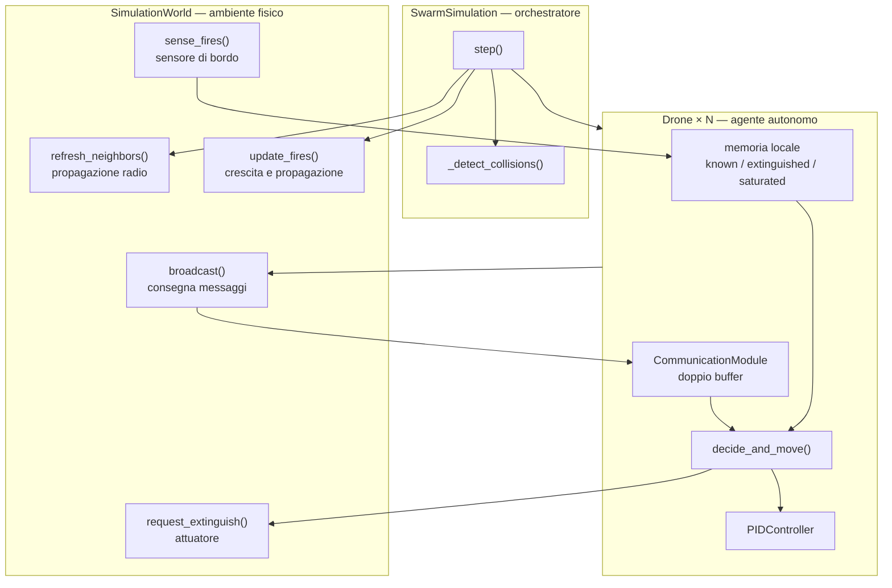
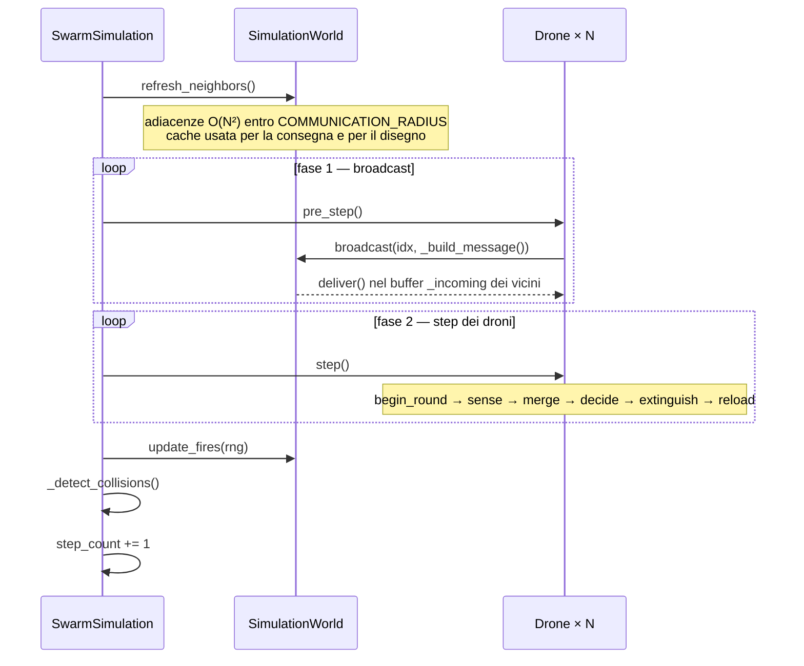
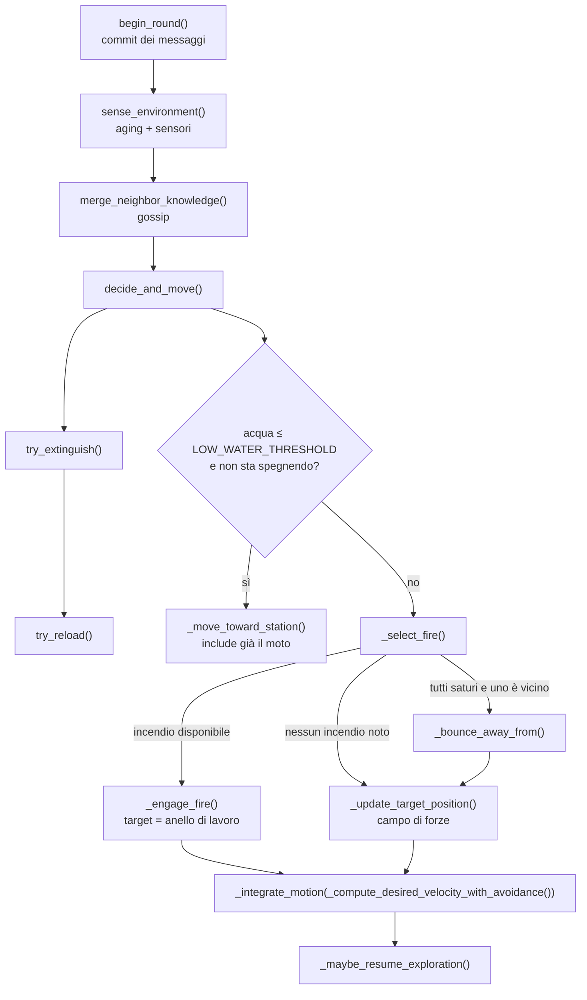
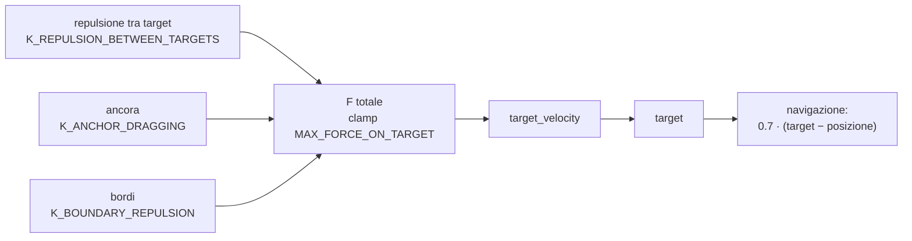
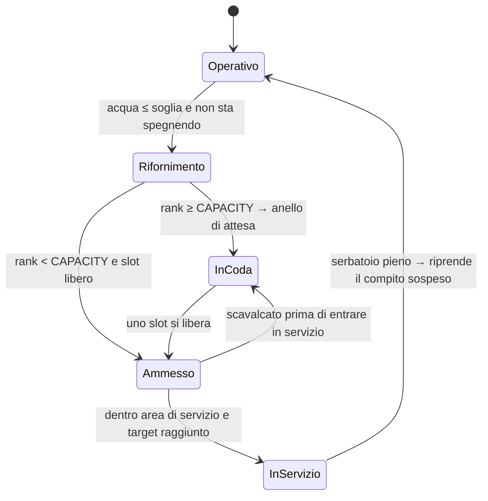

# X-Coverage — sciame decentralizzato per la soppressione di incendi

Simulazione 2D di `NUM_DRONES` droni autonomi che cercano, raggiungono e spengono incendi
dinamici, rifornendosi a stazioni idriche a capacità limitata.

Ogni drone decide **da solo**, usando solo:

- i propri sensori (raggio `FIRE_DETECTION_RADIUS`);
- la propria memoria (incendi noti / spenti / saturi);
- i messaggi ricevuti dai vicini entro `COMMUNICATION_RADIUS`.

Non esiste un coordinatore che assegni incendi, stazioni o rotte.

Il codice di riferimento è **[`xcoverage.py`](xcoverage.py)**. I file `pymain.py` e `main.py` sono
le due versioni precedenti, tenute per confronto; le differenze sono elencate nella
[sezione 12](#12-differenze-rispetto-a-pymainpy-e-mainpy).

---

## Indice

1. [Avvio e comandi](#1-avvio-e-comandi)
2. [Mappa del file](#2-mappa-del-file)
3. [Architettura e confini di responsabilità](#3-architettura-e-confini-di-responsabilità)
4. [Il ciclo di simulazione](#4-il-ciclo-di-simulazione)
5. [Comunicazione: canale radio, messaggio, doppio buffer](#5-comunicazione-canale-radio-messaggio-doppio-buffer)
6. [La pipeline del singolo drone](#6-la-pipeline-del-singolo-drone)
7. [Task allocation sugli incendi](#7-task-allocation-sugli-incendi)
8. [Esplorazione: il campo di forze sul target](#8-esplorazione-il-campo-di-forze-sul-target)
9. [Logistica idrica: coda FIFO e slot di servizio](#9-logistica-idrica-coda-fifo-e-slot-di-servizio)
10. [Collision avoidance a tre livelli](#10-collision-avoidance-a-tre-livelli)
11. [Controllo del moto: PID e integrazione](#11-controllo-del-moto-pid-e-integrazione)
12. [Differenze rispetto a pymain.py e main.py](#12-differenze-rispetto-a-pymainpy-e-mainpy)
13. [Parametri](#13-parametri)
14. [Rendering: legenda](#14-rendering-legenda)
15. [Limiti noti](#15-limiti-noti)

---

## 1. Avvio e comandi

```bash
python xcoverage.py                       # finestra Pygame, scenario deterministico
python xcoverage.py --comm --show-vectors # con topologia radio e vettori di forza
python xcoverage.py --random-fires --random-stations --seed 7
python xcoverage.py --headless --steps 30000 --log
```

| Opzione | Effetto |
|---|---|
| `--show-vectors` / `--no-show-vectors` | vettori di forza e di avoidance (default `SHOW_FORCE_VECTORS`) |
| `--comm` / `--no-comm` | archi della rete di comunicazione (default `SHOW_DRONES_COMMUNICATION`) |
| `--random-fires` | `NUM_FIRES` incendi in posizioni casuali invece dei 3 fissi |
| `--random-stations` | stazioni casuali con separazione `WATER_STATION_MIN_SEPARATION` |
| `--log` | stampa ogni evento di collisione: step, tempo, coppia, distanza |
| `--seed N` | seme della simulazione (default `RANDOM_SEED`) |
| `--headless` | nessuna finestra, nessun import di Pygame, statistiche su stdout |
| `--steps N` | numero di step in modalità headless |

Tasti durante l'esecuzione: `P` pausa, `V` vettori, `C` comunicazione, `Q` esci.

Output headless (una riga ogni 10 s simulati):

```
t=10.0s  incendi attivi=3  spenti=0  collisioni=0  step-contatto=0
```

`collisioni` conta gli **eventi** (una coppia che entra in contatto = 1), `step-contatto` conta la
durata complessiva in step-coppia. La distinzione serve perché una sovrapposizione che dura 50 step
è una collisione, non 50.

All'avvio `validate_config()` stampa su stderr eventuali violazioni degli invarianti geometrici
(vedi [sezione 13](#134-invarianti-verificati-da-validate_config)).

---

## 2. Mappa del file

| Righe | Blocco | Contenuto |
|---|---|---|
| 23–133 | Configurazione | tutte le costanti, raggruppate per sottosistema |
| [135](xcoverage.py#L135) | `validate_config()` | controlla gli invarianti geometrici, restituisce la lista dei problemi |
| 165–184 | Utils | `clamp_magnitude`, `normalize`, `unit_from_angle`, `vec_to_tuple` |
| [186](xcoverage.py#L186) | `PIDController` | PID 2D sulla velocità, con limiti su integrale, output e jerk |
| [226](xcoverage.py#L226) | `Fire` | posizione, `health`, crescita, spegnimento |
| [249](xcoverage.py#L249) | `DroneMessage` | l'unico canale di conoscenza tra droni |
| [264](xcoverage.py#L264) | `CommunicationModule` | doppio buffer + fusione della conoscenza sugli incendi |
| [313](xcoverage.py#L313) | `SimulationWorld` | fisica, sensori, attuatori, canale radio |
| [411](xcoverage.py#L411) | `Drone` | l'agente: percezione, memoria, decisione, controllo |
| [1003](xcoverage.py#L1003) | `SwarmSimulation` | orchestrazione dello step e statistiche |
| [1123](xcoverage.py#L1123) | `Renderer` | disegno Pygame, separato dalla simulazione |
| [1255](xcoverage.py#L1255) | CLI | parser, `run_headless`, `run_simulation` |

Dentro `Drone` i metodi sono raggruppati per sottosistema, nello stesso ordine in cui vengono
eseguiti durante uno step:

| Righe | Gruppo | Metodi |
|---|---|---|
| 468–492 | Comunicazione | `_build_message`, `pre_step`, `merge_neighbor_knowledge` |
| [494](xcoverage.py#L494) | Percezione | `sense_environment` |
| 538–617 | Task allocation incendi | `_fire_rank`, `_select_fire`, `_engage_fire`, `_bounce_away_from` |
| 620–657 | Campo di forze sul target | `compute_repulsion_between_targets`, `compute_boundary_force`, `compute_anchor_force`, `compute_total_force` |
| 660–684 | Dinamica del target | `_sample_exploration_target`, `_refresh_anchor`, `has_reached_target`, `_update_target_position` |
| 686–761 | Collision avoidance | `_compute_collision_avoidance`, `_compute_desired_velocity_with_avoidance` |
| 763–786 | Moto ed esplorazione | `_integrate_motion`, `_maybe_resume_exploration` |
| 788–938 | Stazioni idriche | `_station_priority`, `_station_competitors`, `_select_water_station`, `_update_station_slot`, `_maybe_start_reload`, `_move_toward_station`, `try_reload`, `_resume_point_after_reload` |
| 940–962 | Incendi | `is_extinguishing_fire`, `try_extinguish` |
| 964–1001 | Decisione | `decide_and_move`, `step` |

---

## 3. Architettura e confini di responsabilità

La formulazione corretta del sistema è: **controllo multi-agente decentralizzato simulato in un
ambiente centralizzato**. Il simulatore conosce tutto perché *è* il mondo fisico; il drone no.



Confine preciso, riga per riga:

| Il World fa | Il World **non** fa |
|---|---|
| calcola chi è nel raggio radio di chi ([`refresh_neighbors`](xcoverage.py#L334)) | non passa quella mappa ai droni |
| consegna i messaggi ai destinatari ([`broadcast`](xcoverage.py#L348)) | non filtra né aggrega il contenuto |
| risponde "quali incendi vedi da qui" ([`sense_fires`](xcoverage.py#L353)) | non dice quale ingaggiare |
| applica l'acqua e dichiara quali incendi si sono spenti ([`request_extinguish`](xcoverage.py#L363)) | non decide quando spruzzare |
| fa crescere e propagare gli incendi ([`update_fires`](xcoverage.py#L387)) | — |
| conta le collisioni ([`_detect_collisions`](xcoverage.py#L1079)) | non le risolve: nessuna risposta all'impatto |

Il `Drone` non tiene riferimenti ad altri droni. L'unico modo in cui sa qualcosa degli altri è
`self.communication.neighbors`, cioè un dizionario `{idx: DroneMessage}` di messaggi vecchi di uno
step. Le uniche conoscenze "a priori" sono le dimensioni dell'area e le posizioni delle stazioni
(`self.world.water_stations`): infrastruttura fissa, non stato dinamico.

---

## 4. Il ciclo di simulazione

[`SwarmSimulation.step()`](xcoverage.py#L1064) esegue cinque fasi in ordine rigido, con
$\Delta t$ = `SIM_TIME_STEP` = 0.01 s:



Due proprietà importanti di questa struttura:

- **Tutti i messaggi sono costruiti prima che qualunque drone si muova.** Il drone 0 non può
  pubblicare una posizione già aggiornata mentre il drone 11 sta ancora usando dati vecchi. Lo stato
  pubblicato in un round è quello di fine round precedente, uguale per tutti.
- **Le azioni fisiche restano sequenziali.** Nella fase 2 i droni sono iterati in ordine di indice,
  quindi se due droni spruzzano sullo stesso incendio nello stesso step, quello con indice minore
  toglie `health` per primo. Con `DRONE_WATER_FLOW_RATE * dt` = 0.05 HP per step l'asimmetria è
  trascurabile, ma esiste.

---

## 5. Comunicazione: canale radio, messaggio, doppio buffer

### 5.1 Il messaggio

[`DroneMessage`](xcoverage.py#L249) è l'unica interfaccia tra agenti. Ogni campo esiste perché
qualche decisione lo richiede:

| Campo | Usato da | Per cosa |
|---|---|---|
| `position`, `velocity` | `_compute_collision_avoidance` | CPA e repulsione |
| `target` | `compute_repulsion_between_targets` | separazione dei target in esplorazione |
| `reloading`, `water_station_idx` | `_estimate_station_load`, `_station_competitors` | scelta e coda della stazione |
| `refuel_claim_age` | `_station_priority` | ordinamento FIFO della coda |
| `station_slot` | `_update_station_slot` | quale posto di servizio è già preso |
| `extinguishing` | `_fire_rank` | chi sta già lavorando su un incendio |
| `fire_target` | `_fire_rank` | chi si è impegnato su un incendio |
| `known_fires` | `merge_fire_knowledge` | propagazione epidemica degli incendi |
| `extinguished_fires` | `merge_fire_knowledge` | smentita degli incendi ormai spenti |

`known_fires` ed `extinguished_fires` sono copie (`dict(...)`), quindi il ricevente non può
modificare la memoria del mittente.

### 5.2 Doppio buffer

[`CommunicationModule`](xcoverage.py#L264) tiene due dizionari:

```
pre_step() di tutti i droni          →  scrivono in  _incoming
step() del singolo drone: begin_round()  →  neighbors = _incoming ;  _incoming = {}
```

Quindi durante `decide_and_move()` il drone legge `neighbors`, che è congelato, mentre gli eventuali
messaggi del round successivo finirebbero in un buffer separato. È una forma di **message passing
sincrono**: tutti gli agenti di un round ragionano su informazioni dello stesso istante logico.

### 5.3 Fusione della conoscenza

[`merge_fire_knowledge`](xcoverage.py#L286) in tre passaggi, in quest'ordine:

1. **Spenti (priorità massima):** per ogni `(pos, age)` ricevuto, tiene l'età minima. L'età minima
   vince perché è la notizia più fresca.
2. **Attivi:** stessa regola, ma **saltando** le posizioni già note come spente. Senza questo filtro
   una vecchia voce "attivo" ancora in circolazione farebbe resuscitare un incendio morto.
3. **Pulizia:** rimuove da `known_fires` tutto ciò che nel frattempo è finito in
   `extinguished_fires`.

Dinamica delle età: chi vede fisicamente un incendio lo riscrive ad `age = 0` a ogni step
([`sense_environment`](xcoverage.py#L494)); chi lo conosce solo per sentito dire riceve `age` e lo
incrementa di 1 per step. Quindi su una catena di $k$ hop l'età vale circa $k$ ed è **limitata**
finché esiste un osservatore collegato. Quando la catena si spezza, l'età cresce monotonicamente e la
voce scade dopo `FIRE_MEMORY_TTL_STEPS`.

L'invariante che evita le resurrezioni è
`EXTINGUISHED_FIRE_MEMORY_TTL_STEPS > FIRE_MEMORY_TTL_STEPS` (4500 > 1500 step, cioè 45 s > 15 s):
una voce "attivo" nata prima dello spegnimento muore sempre prima che muoia la smentita.

---

## 6. La pipeline del singolo drone

[`Drone.step()`](xcoverage.py#L989):



Nota: entrambi i rami chiamano `_integrate_motion` **esattamente una volta** per step — il ramo
stazione lo fa dentro `_move_toward_station`, riga [891](xcoverage.py#L891); l'altro alla riga
[986](xcoverage.py#L986).

### 6.1 `sense_environment()` in dettaglio

Quattro blocchi, l'ordine conta:

```python
# 1. aging: known_fires[p] += 1, cancella oltre FIRE_MEMORY_TTL_STEPS
# 2. aging: extinguished_fires[p] += 1, cancella oltre EXTINGUISHED_FIRE_MEMORY_TTL_STEPS
#    e saturated_fires[p] -= 1, cancella a 0
# 3. sensed = {posizioni degli incendi attivi entro FIRE_DETECTION_RADIUS}
#    per ogni fuoco ricordato NON in sensed ma entro il raggio di rilevamento:
#        → è spento: lo sposto in extinguished_fires con age 0
# 4. per ogni fuoco in sensed: known_fires[p] = 0  e  extinguished_fires.pop(p)
```

Il blocco 3 è la **falsificazione locale**: "sono abbastanza vicino da vederlo, non lo vedo, quindi
non c'è più". Il drone che lo constata genera l'informazione `extinguished`, che da lì si propaga per
gossip. Il blocco 4 stabilisce la precedenza dell'osservazione diretta sul sentito dire: un incendio
effettivamente percepito cancella l'eventuale smentita ricevuta.

Il confronto usa la stessa disuguaglianza di `sense_fires` (`norm(...) <= FIRE_DETECTION_RADIUS`) e
le stesse chiavi (`vec_to_tuple` della posizione esatta), quindi non esistono casi limite in cui un
incendio è contemporaneamente "visibile" e "non sensato".

### 6.2 La memoria del drone

| Struttura | Tipo | Aging | Scopo |
|---|---|---|---|
| `known_fires` | `{(x,y): età in step}` | +1/step, TTL 1500 | incendi da ingaggiare |
| `extinguished_fires` | `{(x,y): età in step}` | +1/step, TTL 4500 | smentite da propagare |
| `saturated_fires` | `{(x,y): step residui}` | −1/step, 500 | incendi da ignorare perché già presidiati |
| `fire_target` | `(x,y)` o `None` | — | impegno corrente (dichiarato nel messaggio) |
| `interrupted_fire` | `(x,y)` o `None` | — | compito sospeso dal rifornimento |
| `interrupted_target` | punto o `None` | — | dove stava andando quando è partito per la stazione |

`saturated_fires`, `interrupted_fire` e `interrupted_target` sono **locali e non comunicate**: sono
decisioni e intenzioni personali, non fatti sul mondo, e per questo non hanno età e non entrano nel
gossip. La distinzione è importante: l'età in `known_fires` misura la *freschezza
dell'informazione* ed è ciò che fa convergere il protocollo epidemico; scrivere lì dentro qualcosa
che non si è osservato significherebbe mentire ai vicini.

---

## 7. Task allocation sugli incendi

### 7.1 Il problema

Il limite `MAX_DRONES_ON_FIRE` non può essere un contatore globale: nessuno lo può leggere. Serve una
regola che, applicata da ogni drone sui propri dati locali, produca la stessa decisione collettiva.

La geometria lo rende possibile: due droni che spengono lo stesso incendio sono entrambi entro
`FIRE_EXTINGUISH_RADIUS` = 1.2 m dal centro, quindi a non più di 2.4 m tra loro, cioè **dentro**
`COMMUNICATION_RADIUS` = 2.5 m. Chi lavora sullo stesso fuoco si sente sempre. È l'invariante
`2·FIRE_EXTINGUISH_RADIUS ≤ COMMUNICATION_RADIUS`, controllato da `validate_config()`.

### 7.2 `_fire_rank()` — quanti hanno precedenza su di me

[Riga 538.](xcoverage.py#L538) Chiave di priorità, la stessa per sé e per gli altri:

```
key = (0 se sta già spegnendo QUESTO incendio altrimenti 1,  distanza dal centro,  idx)
```

Un vicino è considerato impegnato su quell'incendio se `msg.fire_target == fire_pos` **oppure** se
`msg.extinguishing and dist(msg.position, fire) <= FIRE_EXTINGUISH_RADIUS`. `rank` è il numero di
impegnati con chiave minore della mia.

Le tre componenti hanno ciascuna un ruolo: il primo campo rende la regola **non prelazionabile** (chi
sta già lavorando non viene scalzato da un nuovo arrivato più vicino), il secondo premia chi fa meno
strada, il terzo rompe i pareggi in modo deterministico e uguale per tutti.

### 7.3 `_select_fire()` — scelta con impegno e memoria di saturazione

[Riga 559.](xcoverage.py#L559)

```python
candidati = [incendi noti non in saturated_fires] ordinati per distanza
se fire_target è tra i candidati: portalo in testa      # impegno: niente oscillazioni
per ogni candidato:
    se _fire_rank(c) < MAX_DRONES_ON_FIRE:  return (c, None)
    saturated_fires[c] = FIRE_SATURATION_MEMORY_STEPS
    se è il primo saturo entro FIRE_DETECTION_RADIUS: ricordalo come bounce_from
return (None, bounce_from)
```

Tre meccanismi in poche righe:

- **impegno**: il target corrente viene rivalutato per primo, quindi due incendi quasi equidistanti
  non fanno oscillare il drone;
- **degradazione**: se il più vicino è saturo si passa al secondo, non si rinuncia;
- **memoria**: l'incendio saturo viene escluso per `FIRE_SATURATION_MEMORY_S` = 5 s, altrimenti il
  drone rimbalzerebbe, uscirebbe dal raggio radio, "dimenticherebbe" di essere di troppo e
  tornerebbe indietro all'infinito.

### 7.4 `_engage_fire()` — l'anello di lavoro

[Riga 583.](xcoverage.py#L583) Il target non è il centro dell'incendio, ma il punto dell'anello di
raggio `FIRE_WORK_RADIUS` = 0.8 m nella direzione da cui il drone arriva:

```python
bearing = normalize(position - fire)          # se nullo: angolo aureo da idx
target  = fire + bearing * FIRE_WORK_RADIUS
```

Il target vincola quindi **solo la distanza radiale** dal fuoco; la posizione angolare resta libera e
viene determinata dalla collision avoidance, che spinge i droni lateralmente finché non sono
distanziati. È il motivo per cui l'avoidance non va indebolita quando due droni spengono insieme:

```
        fuoco (raggio di spegnimento 1.2)
              ·······
           ···   D1  ···            anello di lavoro r = 0.8
         ··       ●     ··          corda tra due droni a 120° :
        ·      ✳ centro    ·          2 · 0.8 · sin(60°) = 1.386 m
        ·   D3 ●       ● D2 ·       ≥ AVOID_MIN_DISTANCE = 1.0 m  ✓
         ··             ··
           ···········
```

Con `MAX_DRONES_ON_FIRE` = 3 l'anello ospita tutti a distanza di sicurezza; l'invariante
$2 \cdot r_{\text{work}} \cdot \sin(\pi / N_{\max}) \ge d_{\min}$ è verificato da `validate_config()`.
Inoltre $0.8 + 0.2 \le 1.2$ garantisce che un drone "arrivato" (entro `TARGET_REACHED_DISTANCE`) stia
comunque dentro il raggio di spegnimento.

`_engage_fire` riallinea anche `anchor_target` al target: quando l'incendio si spegne e il drone
torna in esplorazione, l'ancora non lo richiama verso un punto vecchio di decine di secondi.

### 7.5 `_bounce_away_from()`

[Riga 601.](xcoverage.py#L601) Se tutti gli incendi noti sono saturi e uno di essi è entro il raggio
di rilevamento, il drone proietta il target a `FIRE_SATURATION_BOUNCE_DISTANCE` = 3.5 m in direzione
radiale uscente, azzera `target_velocity` e riallinea l'ancora. Poi prosegue in esplorazione dal
nuovo punto. Il parametro è una **distanza**, non una forza (in `pymain.py` si chiamava
`..._BOUNCE_FORCE` pur essendo usato come spostamento).

### 7.6 `try_extinguish()`

[Riga 916.](xcoverage.py#L916) Il drone chiede al mondo di spruzzare; il mondo restituisce
`(acqua_usata, lista_posizioni_spente)`:

```python
used, extinguished = world.request_extinguish(position, water, DRONE_WATER_FLOW_RATE)
water -= used                       # snap a 0 sotto 1e-9
for p in extinguished:              # il drone HA VISTO spegnersi quell'incendio
    known_fires.pop(p); saturated_fires.pop(p); extinguished_fires[p] = 0
    if fire_target == p: fire_target = None
```

Il ritorno della lista è la forma pulita del feedback dell'attuatore: l'agente registra come spento
solo ciò che ha effettivamente osservato spegnersi, e quell'informazione entra subito nel messaggio
del round successivo.

### 7.7 Economia dell'acqua

Numeri utili per leggere il comportamento emergente:

| Grandezza | Valore |
|---|---|
| Acqua a bordo | 20.0 |
| Portata | 5.0 /s → **4 s** di getto continuo |
| Danno per pieno | 20 HP |
| Vita di un incendio | 200 HP → **10 pieni** |
| Crescita | +0.5 HP/s |
| Rifornimento | 10.0 /s → 2 s per il pieno |
| Soglia di rientro | 2.0 (10% della capacità) |

Un incendio non presidiato raggiunge `FIRE_HEALTH · FIRE_SPAWN_THRESHOLD` = 240 HP dopo 80 s, e da
quel momento genera un figlio con probabilità 0.003 per step, cioè circa **uno ogni 3.3 s**. Con
pochi droni o molti incendi iniziali lo scenario diventa supercritico e diverge: è il comportamento
osservato con `--random-fires` e `NUM_FIRES` ≥ 6.

---

## 8. Esplorazione: il campo di forze sul target

Quando non c'è né rifornimento né incendio, il drone non insegue un punto fisso: insegue un **target
virtuale** che a sua volta si muove in un campo di forze. È la parte di `pymain.py` conservata
integralmente.



### 8.1 Le tre forze

- [`compute_repulsion_between_targets`](xcoverage.py#L620): per ogni **messaggio** ricevuto, se
  `|target − msg.target| < TARGET_SEPARATION` aggiunge una repulsione lineare nella penetrazione.
  Nota: usa `msg.target`, non l'oggetto del vicino — in `pymain.py` leggeva `other.target`
  direttamente dall'altro drone, in parte già aggiornato nello stesso step.
- [`compute_boundary_force`](xcoverage.py#L636): componente per componente, spinge il target
  all'interno quando entra entro `MARGIN_REPULSION_BOUNDARY` dal bordo.
- [`compute_anchor_force`](xcoverage.py#L649): molla verso `anchor_target`, il "punto base" del
  drone.

### 8.2 Dinamica del target

[`_update_target_position`](xcoverage.py#L671):

$$v_t \leftarrow e^{-\lambda \Delta t}\, v_t + F \Delta t, \qquad \lambda = 10.5\ \text{s}^{-1}$$

$$\text{target} \leftarrow \text{target} + v_t \Delta t \quad\text{(poi clip all'area)}$$

Lo smorzamento è scritto come tasso continuo: $e^{-10.5 \cdot 0.01} = 0.9003$, cioè esattamente il
vecchio fattore "0.9 per step", ma ora il valore ha un significato temporale (costante di tempo
≈ 95 ms) e non cambia comportamento se si cambia `SIM_TIME_STEP`.

L'ancora insegue il target con lo stesso schema, ma lentissima:

$$\text{anchor} \leftarrow \text{anchor} + (\text{target} - \text{anchor}) \left(1 - e^{-0.0075 \Delta t}\right)$$

cioè costante di tempo ≈ 133 s. In pratica l'ancora è un punto quasi fisso che viene **riposizionato
di colpo** nei momenti significativi: nuovo target di esplorazione, rimbalzo, ingaggio di un
incendio, arrivo alla stazione, fine rifornimento.

### 8.3 Ripresa dell'esplorazione

[`_maybe_resume_exploration`](xcoverage.py#L771): se il drone non sta rifornendo, non ha un
`fire_target` e ha raggiunto il target, incrementa `idle_steps`; oltre `MAX_IDLE_STEPS` = 30
(0.3 s) estrae un nuovo target uniforme nell'area e riallinea ancora e target originale.

La condizione **non** include più "non conosce incendi": in `pymain.py` un drone che conosceva solo
incendi saturi non estraeva mai un nuovo target e restava fermo indefinitamente.

---

## 9. Logistica idrica: coda FIFO e slot di servizio

### 9.1 Geometria della stazione

```
              ·  ·  ·  anello di attesa r = 1.9
          ·                           ·
       ·        ┌───────────────┐        ·
      ·         │  area servizio │         ·
     ·          │    r = 0.8     │          ·
     ·      slot 0 ●     ✳     ● slot 1     ·      slot a ±0.55 dal centro
     ·          │               │          ·      distanza tra slot = 1.1 ≥ 1.0
      ·         └───────────────┘         ·
       ·                                ·
          ·                          ·
              ·  ·  ·  ·  ·  ·  ·
```

I tre raggi sono legati da invarianti che `validate_config()` controlla:

| Invariante | Valore | Perché |
|---|---|---|
| `2·SLOT_RADIUS·sin(π/CAPACITY) ≥ AVOID_MIN_DISTANCE` | 1.1 ≥ 1.0 | due droni in servizio non si respingono a vicenda |
| `SLOT_RADIUS + TARGET_REACHED_DISTANCE ≤ SERVICE_RADIUS` | 0.75 ≤ 0.8 | chi "ha raggiunto" lo slot è dentro l'area di servizio, altrimenti stallo |
| `WAIT_RADIUS + SLOT_RADIUS ≤ COMMUNICATION_RADIUS` | 2.45 ≤ 2.5 | **chi attende sente chi è in servizio** |
| `WAIT_RADIUS − SLOT_RADIUS ≥ AVOID_MIN_DISTANCE` | 1.35 ≥ 1.0 | la coda non spinge via chi sta rifornendo |

Il terzo è il più delicato: con l'anello di attesa a 2.4 m di `pymain.py` un drone in coda distava
fino a 3.05 m dai droni in servizio, quindi **non li sentiva**, credeva la stazione libera, si
avvicinava, scopriva l'occupazione e tornava indietro, in un ciclo continuo.

### 9.2 Priorità: FIFO non prelazionabile

[`_station_priority`](xcoverage.py#L791):

```
key = (0 se già in servizio altrimenti 1,  −refuel_claim_age,  idx)
```

`refuel_claim_age` parte da 0 all'inizio del rifornimento e cresce di 1 per step, quindi **età
maggiore = richiesta più vecchia = precedenza**. Il segno meno serve proprio a questo: in `pymain.py`
la chiave era `min(refuel_claim_age, idx)`, cioè l'ultimo arrivato scavalcava tutti e interrompeva
chi stava già riempiendo il serbatoio.

Il primo campo garantisce la non-prelazione: un drone già nell'area di servizio con uno slot non
viene mai scalzato, nemmeno da una richiesta più vecchia.

### 9.3 Ammissione e assegnazione degli slot

[`_update_station_slot`](xcoverage.py#L829), eseguito a ogni step mentre `reloading`:

```python
competitors = [me] + [vicini con reloading e stessa stazione]   # ordinati per chiave
my_rank = posizione di me nella lista
se my_rank >= WATER_STATION_CAPACITY:  station_slot = None ; return   # in coda
se qualcuno con chiave migliore occupa il mio slot:  station_slot = None   # cedo
se station_slot is None:  prendi il minimo slot non occupato dai vicini
```

Lo slot è **appiccicoso**: una volta preso non cambia fino a fine rifornimento, altrimenti la
partenza del drone nello slot 0 farebbe migrare il drone nello slot 1 a metà rifornimento.

I conflitti sono possibili perché i dati hanno uno step di ritardo e perché due droni in attesa su
lati opposti dell'anello (3.8 m) non si sentono: entrambi possono scegliere lo slot 0. La
convergenza è garantita dal fatto che avvicinandosi rientrano nel raggio radio e chi ha chiave
peggiore cede. Nel frattempo la collision avoidance li tiene separati.

### 9.4 Ciclo di vita del rifornimento



- [`_maybe_start_reload`](xcoverage.py#L850): scatta solo se il drone **non** sta spegnendo, così
  prima esaurisce l'acqua sull'incendio e poi rientra. Sceglie la stazione con
  [`_select_water_station`](xcoverage.py#L814), che ordina per `(satura, distanza, carico)` usando
  `_estimate_station_load`, cioè il numero di vicini noti diretti a quella stazione. È una stima
  locale e parziale, ed è tutto ciò che il drone può sapere.
- [`_move_toward_station`](xcoverage.py#L868): incrementa `refuel_claim_age`, aggiorna lo slot e
  fissa il target: lo slot se ammesso, altrimenti il punto dell'anello di attesa **nella direzione da
  cui arriva** — stesso principio dell'anello di lavoro sugli incendi, la spaziatura lungo l'anello
  la fa l'avoidance.
- [`try_reload`](xcoverage.py#L893): riempie solo se `station_slot is not None` **e**
  `has_reached_target()` **e** il drone è dentro `WATER_STATION_SERVICE_RADIUS`. In `pymain.py`
  bastava `has_reached_target()`, quindi i droni si rifornivano anche dal punto di attesa: nei
  benchmark ciò accadeva per 800–5000 step per run, e rendeva la capacità della stazione
  irrilevante.
- [`_resume_point_after_reload`](xcoverage.py#L916): a pieno completato il drone **riprende il
  compito sospeso** invece di estrarre un target casuale. In ordine: l'incendio che stava gestendo
  (se non è arrivata nel frattempo una smentita in `extinguished_fires`), poi il punto verso cui
  stava andando, infine un target casuale.

  Serve perché il viaggio di rifornimento dura più della memoria degli incendi: misurando 30 000
  step con le stazioni in un angolo dell'area, un ciclo completo dura in media **16–23 s** e arriva
  a **57 s**, contro un `FIRE_MEMORY_TTL_S` di 15 s. Senza questo meccanismo il drone torna
  operativo con `known_fires` vuoto proprio mentre era fermo in coda, e riparte a caso. Con 12
  droni, nel 70% dei rifornimenti la ripartenza punta a un incendio ancora acceso.

  L'incendio **non** viene reinserito in `known_fires`: il drone non ha osservato nulla di nuovo, ha
  solo l'intenzione di tornare a controllare. Arrivato entro `FIRE_DETECTION_RADIUS`,
  `sense_environment()` conferma (`known_fires[p] = 0`) o falsifica (`extinguished_fires[p] = 0`), e
  in entrambi i casi l'informazione che ne esce è vera. La scommessa è quasi sempre buona: un
  incendio richiede 10 pieni per essere spento e un drone ne consegna uno per viaggio, quindi al
  ritorno di solito brucia ancora.

---

## 10. Collision avoidance a tre livelli

```
  0.1 m        0.8 m                 1.0 m + 0.6·|v|              2.5 m
   │             │                          │                        │
   ▼             ▼                          ▼                        ▼
COLLISIONE   EMERGENZA                 PREDITTIVO               ORIZZONTE
(rilevata)   (domina il task)          (campo di forze)         (raggio radio)
```

### 10.1 Livello predittivo: punto di massimo avvicinamento

[`_compute_collision_avoidance`](xcoverage.py#L686). Per ogni vicino, con
$r = p_{\text{me}} - p_{\text{altro}}$ e $v = v_{\text{me}} - v_{\text{altro}}$:

$$t_{ca} = \mathrm{clip}\left(\frac{-\,r \cdot v}{\lVert v \rVert^2},\ 0,\ T\right), \qquad
c = r + v\, t_{ca}, \qquad d_{ca} = \lVert c \rVert$$

$t_{ca}$ è l'istante in cui i due droni sono più vicini nell'intervallo $[0, T]$ con
$T$ = `AVOID_LOOKAHEAD` = 1.5 s. Guardare solo $r + vT$, come faceva `pymain.py`, significa
misurare la distanza all'istante finale e non accorgersi di un passaggio ravvicinato a metà
intervallo:

```
      t=0      2.5 m
      t=1.0    0.5 m
      t=1.25   0.0 m   ← collisione mancata dal test "solo a t=T"
      t=2.0    1.5 m   ← ciò che pymain.py misurava
```

Se $d_{ca}$ è sotto il margine dinamico
$m = \text{AVOID\_MIN\_DISTANCE} + \text{SAFE\_DISTANCE\_K\_VEL} \cdot \lVert v_{\text{me}} \rVert$,
si aggiunge alla velocità desiderata:

$$\Delta v = \hat{c}\ \left( K_{\text{rep}} \frac{m - d_{ca}}{m} + K_{\text{damp}} \, s_{\text{cl}} \right),
\qquad s_{\text{cl}} = \max\left(0,\ -v \cdot \hat{r}\right)$$

Due dettagli:

- **la direzione è $\hat c$, non $\hat r$.** $c$ è il vettore di scarto al momento del passaggio più
  ravvicinato, quindi la correzione allarga la distanza di passaggio: spinge **di lato**, non
  all'indietro. È anche ciò che evita lo stallo frontale.
- $T$ = 1.5 s è dimensionato sulla dinamica, non sulla geometria. Da 1 m/s, con `MAX_JERK` = 8 e
  `PID_MAX_OUTPUT_ACCEL` = 4, l'arresto richiede ~0.5 s e ~0.33 m; due droni frontali entrano in
  raggio radio a 2.5 m chiudendo a 2 m/s, cioè 1.25 s prima dell'impatto: l'orizzonte deve coprirlo.

Casi degeneri gestiti esplicitamente:

| Caso | Condizione | Direzione usata |
|---|---|---|
| passaggio frontale perfetto | $d_{ca} \approx 0$, $\lVert v \rVert > 0$ | perpendicolare a $v$ — per l'altro drone $v$ è opposta, quindi i due scartano da lati diversi |
| sovrapposizione esatta da fermi | $\lVert r \rVert \approx 0$, $\lVert v \rVert \approx 0$ | $\pm \hat x$ secondo il confronto degli indici (`pymain.py` faceva `continue`, cioè ignorava il caso) |

La somma su tutti i vicini è limitata a `AVOID_MAX_CORRECTION` = 3.0 m/s.

### 10.2 Livello di emergenza

Se la distanza **attuale** è sotto `EMERGENCY_AVOID_DISTANCE` = 0.8 m:

$$e \mathrel{+}= \hat r \,(0.8 - d)\, K_{\text{emg}} - v \cdot K_{\text{damp,emg}}$$

e il termine di navigazione viene ridotto a `EMERGENCY_TARGET_WEIGHT` = 0.25. Questo livello **non
viene mai disabilitato**, nemmeno tra due droni che spengono lo stesso incendio: la separazione
fisica è un vincolo, la condivisione del task è una politica.

### 10.3 Composizione: perché l'ordine dei clamp conta

[`_compute_desired_velocity_with_avoidance`](xcoverage.py#L743):

```python
navigation = clamp(K_DESIRED_VEL_TO_TARGET * (target - position), MAX_DRONE_SPEED)   # ← clamp PRIMA
if emergency: desired = emergency_vector + EMERGENCY_TARGET_WEIGHT * navigation
else:         desired = navigation + predictive
return clamp(desired, MAX_DRONE_SPEED)
```

Con un target a 15 m il termine di navigazione grezzo vale $0.7 \cdot 15 = 10.5$ m/s. Sommandogli
una correzione di 2 m/s e limitando solo alla fine, l'avoidance sopravvive per circa il 16% del suo
valore: è il motivo per cui in `pymain.py` le collisioni avvenivano **in transito**, non sugli
incendi. Limitando prima la navigazione, la correzione conta per quello che vale.

### 10.4 Terzo livello: rilevamento, non risposta

[`_detect_collisions`](xcoverage.py#L1079) conta le coppie sotto `DRONE_IMPACT_RADIUS` e **non
applica nessun impulso di separazione**: i droni si compenetrano. È una scelta deliberata — in uno
sciame decentralizzato la separazione deve emergere dal controllo locale, e una risposta centrale
all'impatto maschererebbe i difetti dell'avoidance invece di mostrarli. Il nome del metodo lo dice
(`_detect_`, non `_resolve_`).

---

## 11. Controllo del moto: PID e integrazione

[`PIDController.step`](xcoverage.py#L207) lavora sull'**errore di velocità** e produce
un'accelerazione:

$$e = v_{\text{des}} - v, \qquad
I \leftarrow \mathrm{clip}(I + e\,\Delta t,\ \pm 3), \qquad
a^\* = \mathrm{clamp}\!\left(K_p e + K_i I + K_d \frac{e - e_{-1}}{\Delta t},\ 4\right)$$

seguito dal limite di jerk, che è ciò che dà al drone l'inerzia dinamica:

$$a \leftarrow \mathrm{clamp}\big(a + \mathrm{clamp}(a^\* - a,\ \text{MAX\_JERK} \cdot \Delta t),\ 4\big)$$

[`_integrate_motion`](xcoverage.py#L763) chiude la catena, tutto con lo stesso $\Delta t$:

```
desired_velocity → PID → acceleration → velocity (clamp 1.0 m/s) → position (clip all'area)
```

`pid.reset()` viene chiamato ai cambi di modalità (inizio rifornimento, fine rifornimento) per
evitare che l'integrale accumulato in una fase sporchi la successiva.

Conseguenza pratica: il drone **non può** fermarsi istantaneamente. Da 1 m/s servono circa 0.5 s e
0.33 m, ed è per questo che il margine di sicurezza cresce con la velocità
(`SAFE_DISTANCE_K_VEL · |v|`) invece di essere puramente geometrico.

---

## 12. Differenze rispetto a `pymain.py` e `main.py`

### 12.1 Correzioni logiche

| # | Problema | Dove era | Soluzione in `xcoverage.py` |
|---|---|---|---|
| 1 | Avoidance diluita dal clamp finale | entrambi | navigazione limitata **prima** della somma ([743](xcoverage.py#L743)) |
| 2 | Distanza prevista solo a $t=T$ | `pymain` | punto di massimo avvicinamento ([686](xcoverage.py#L686)) |
| 3 | Avoidance disattivata tra chi spegne | `pymain` (`continue`), attenuata a 0.3 in `main` | anello di lavoro a 0.8 m: avoidance piena, nessun caso speciale |
| 4 | Droni sovrapposti ignorati | entrambi | direzione di fallback dagli indici |
| 5 | Coda stazione LIFO, con prelazione di chi sta rifornendo | entrambi | `−refuel_claim_age` + priorità a chi è in servizio ([791](xcoverage.py#L791)) |
| 6 | Capacità 2 che funzionava come 1 | entrambi | slot espliciti e appiccicosi ([829](xcoverage.py#L829)) |
| 7 | Rifornimento anche dalla coda | entrambi | `try_reload` verifica slot + area di servizio ([893](xcoverage.py#L893)) |
| 8 | Anello di attesa fuori dal raggio radio | entrambi | `WAIT_RADIUS` 2.4 → 1.9, invariante verificato |
| 9 | Sempre l'incendio più vicino, anche saturo → rimbalzo ciclico | entrambi | `saturated_fires` + scelta del candidato successivo |
| 10 | Saturazione superata (fino a 5 droni) | `main` | `_fire_rank` deterministico e condiviso |
| 11 | Incendio cancellato dalla memoria a **ogni** getto, anche se acceso | `pymain` | `request_extinguish` restituisce cosa si è spento davvero |
| 12 | Chi spegne non registrava `extinguished` | `pymain` | registrazione + propagazione via gossip |
| 13 | Esplorazione bloccata se si conoscono solo incendi saturi | entrambi | rimossa la condizione `not known_fires` |
| 14 | Memoria incendi di 1 s contro voli di ~20 s | entrambi | `FIRE_MEMORY_TTL_S` = 15 s, espressa in secondi |
| 15 | Smorzamento del target annullato (`exp(−0.1·0.01)` ≈ 0.999) | `main` | tasso 10.5 s⁻¹, identico al comportamento originale |
| 16 | Vettore di emergenza calcolato due volte, il primo scartato | `main` | calcolo unico |
| 17 | Lettura diretta di `other.target` da altri oggetti `Drone` | entrambi | solo `msg.target` dai messaggi |
| 18 | Collisioni contate per step (una sovrapposizione lunga = decine) | entrambi | eventi di ingresso in contatto |
| 19 | `SAFE_DISTANCE_BASE`, `K_DAMPING_*`, `TAU`, `WATER_STATION_POS`, `CAMERA_DISTANCE_FACTOR` mai usati | entrambi | rimossi o effettivamente usati; `validate_config()` |
| 20 | Dopo il pieno si ripartiva da un punto casuale, perdendo l'emergenza in corso | entrambi | `_resume_point_after_reload` ([916](xcoverage.py#L916)) |

### 12.2 Cose rimosse di proposito

- **`compute_fire_force` / `K_FIRE_DRAGGING`**: il target veniva riscritto a ogni step, quindi quella
  forza lo spostava di ~0.0005 m per step. Era una forza senza effetto, disegnata tra i vettori.
- **Blocco forzato della velocità alla stazione** (`velocity[:] = 0`): violava il limite di jerk. Ora
  è il PID a tenere fermo il drone.
- **`FIRE_TASK_AVOIDANCE_SCALE`** di `main.py`: superfluo una volta introdotto l'anello di lavoro.

### 12.3 Misure

Benchmark headless, posizioni reali dei droni, 300 s simulati per seed.

Scenario deterministico, 3 incendi, seed 42/1/2:

| | `pymain.py` | `main.py` | `xcoverage.py` |
|---|---|---|---|
| Collisioni | 1 / 4 / 5 | 0 | **0** |
| Distanza minima raggiunta | 0.072 m | 0.403 m | **0.403 m** |
| Tempo per spegnere tutto | 96 / 101 / 127 s | 95 / 131 / 110 s | **75 / 75 / 78 s** |
| Max droni su un incendio (limite 3) | 4 | 5 | **3** |
| Step di rifornimento fuori stazione | 836–1400 | 958–1450 | **0** |

Scenario `--random-fires` con `NUM_FIRES` = 4, 6 seed:

| | `pymain.py` | `main.py` | `xcoverage.py` |
|---|---|---|---|
| Seed completamente spenti | 3 / 6 | 3 / 6 | **5 / 6** |
| Tempo quando ci riesce | 166–234 s | 156–210 s | **90–118 s** |
| Incendi residui nei casi falliti | 37–62 | 11–81 | **3** |
| Collisioni totali | 12 | 0 | **0** |

Il guadagno sul tempo di spegnimento non viene dall'avoidance ma dalla logistica: coda FIFO,
capacità reale 2 e niente rifornimenti fantasma significano più tempo di getto per drone.

---

## 13. Parametri

### 13.1 Simulazione

| Nome | Valore | Note |
|---|---|---|
| `NUM_DRONES` | 12 | |
| `AREA_WIDTH` × `AREA_HEIGHT` | 20 × 12 m | |
| `SIM_TIME_STEP` | 0.01 s | usato ovunque, mai un dt implicito |
| `RANDOM_SEED` | 42 | sovrascrivibile con `--seed` |
| `NUM_FIRES` | 3 | solo con `--random-fires` |

Ogni drone ha un generatore casuale privato (`random.Random(f"drone-{seed}-{idx}")`), così le sue
scelte non consumano il generatore degli incendi: cambiare il comportamento dei droni non cambia la
sequenza di propagazione, e i confronti restano validi.

### 13.2 Percezione, memoria, moto

| Nome | Valore | Ruolo |
|---|---|---|
| `COMMUNICATION_RADIUS` | 2.5 m | orizzonte radio |
| `FIRE_DETECTION_RADIUS` | 2.0 m | sensore incendi |
| `FIRE_MEMORY_TTL_S` | 15 s | 1500 step |
| `EXTINGUISHED_FIRE_MEMORY_TTL_STEPS` | 4500 | 3× la memoria attiva |
| `FIRE_SATURATION_MEMORY_S` | 5 s | esclusione di un incendio saturo |
| `MAX_DRONE_SPEED` | 1.0 m/s | |
| `PID_KP / KI / KD` | 3.4 / 0.6 / 0.25 | taratura originale, non modificata |
| `PID_MAX_OUTPUT_ACCEL` | 4.0 m/s² | |
| `MAX_JERK` | 8.0 m/s³ | |
| `TARGET_VEL_DAMPING_RATE` | 10.5 s⁻¹ | $e^{-\lambda \Delta t} = 0.9003$ |
| `ANCHOR_TO_TARGET_INTENSITY` | 0.0075 s⁻¹ | τ ≈ 133 s |
| `MAX_IDLE_STEPS` | 30 | 0.3 s |

### 13.3 Sicurezza e compiti

| Nome | Valore | Ruolo |
|---|---|---|
| `DRONE_IMPACT_RADIUS` | 0.1 m | soglia di collisione |
| `EMERGENCY_AVOID_DISTANCE` | 0.8 m | livello 2 |
| `AVOID_MIN_DISTANCE` | 1.0 m | margine base livello 1 |
| `SAFE_DISTANCE_K_VEL` | 0.6 s | termine dinamico del margine |
| `AVOID_LOOKAHEAD` | 1.5 s | orizzonte CPA |
| `K_AVOID_REPULSION` / `K_AVOID_DAMPING` | 7.2 / 2.2 | guadagni livello 1 |
| `AVOID_MAX_CORRECTION` | 3.0 m/s | saturazione livello 1 |
| `EMERGENCY_AVOID_GAIN` / `EMERGENCY_DAMPING` | 6.0 / 0.8 | guadagni livello 2 |
| `FIRE_EXTINGUISH_RADIUS` | 1.2 m | raggio di efficacia del getto |
| `FIRE_WORK_RADIUS` | 0.8 m | anello di lavoro |
| `MAX_DRONES_ON_FIRE` | 3 | stima locale, non contatore globale |
| `WATER_STATION_CAPACITY` | 2 | slot reali |
| `WATER_STATION_SERVICE_RADIUS` | 0.8 m | |
| `WATER_STATION_SLOT_RADIUS` | 0.55 m | |
| `WATER_STATION_WAIT_RADIUS` | 1.9 m | |

### 13.4 Invarianti verificati da `validate_config()`

| Invariante | Verifica con i default |
|---|---|
| `IMPACT < EMERGENCY < AVOID_MIN < COMMUNICATION` | 0.1 < 0.8 < 1.0 < 2.5 ✓ |
| `2·FIRE_EXTINGUISH_RADIUS ≤ COMMUNICATION_RADIUS` | 2.4 ≤ 2.5 ✓ |
| `FIRE_WORK_RADIUS + TARGET_REACHED ≤ FIRE_EXTINGUISH_RADIUS` | 1.0 ≤ 1.2 ✓ |
| `2·FIRE_WORK_RADIUS·sin(π/MAX_DRONES_ON_FIRE) ≥ AVOID_MIN_DISTANCE` | 1.386 ≥ 1.0 ✓ |
| `2·SLOT_RADIUS·sin(π/CAPACITY) ≥ AVOID_MIN_DISTANCE` | 1.1 ≥ 1.0 ✓ |
| `SLOT_RADIUS + TARGET_REACHED ≤ SERVICE_RADIUS` | 0.75 ≤ 0.8 ✓ |
| `WAIT_RADIUS + SLOT_RADIUS ≤ COMMUNICATION_RADIUS` | 2.45 ≤ 2.5 ✓ |
| `WAIT_RADIUS − SLOT_RADIUS ≥ AVOID_MIN_DISTANCE` | 1.35 ≥ 1.0 ✓ |
| `TTL spenti > TTL attivi` | 4500 > 1500 ✓ |

Toccando un parametro senza il suo vicino, il messaggio su stderr dice quale ipotesi si è rotta.

---

## 14. Rendering: legenda

Il `Renderer` ([1123](xcoverage.py#L1123)) è indipendente dalla simulazione: importa Pygame solo nel
proprio `__init__`, quindi `--headless` non richiede la libreria grafica.

| Elemento | Significato |
|---|---|
| Cerchio pieno colorato | drone; il colore va dal ciano (serbatoio pieno) al rosso (vuoto), raggio = `DRONE_IMPACT_RADIUS` in scala reale |
| Anello giallo attorno al drone | sta spegnendo (`is_extinguishing_fire()`) |
| Anello ciano attorno al drone | ammesso alla stazione, ha uno slot |
| Punto rosso | `target` corrente |
| Punto verde | `original_target` |
| Cerchietto lilla vuoto | `anchor_target` |
| Tratteggio magenta | drone → target |
| Tratteggio verde | drone → ancora |
| Linee azzurre sottili | archi radio attivi (`--comm`) |
| Cerchio arancione esterno / interno sul fuoco | `FIRE_DETECTION_RADIUS` / `FIRE_EXTINGUISH_RADIUS` |
| Disco semitrasparente sul fuoco | intensità: più rosso = più `health`; il numero sopra è la vita |
| Cerchio blu spesso / sottile sulla stazione | area di servizio (`WATER_STATION_SERVICE_RADIUS`) / anello di attesa (`WATER_STATION_WAIT_RADIUS`) |

Con `--show-vectors` (tasto `V`), applicati al target: giallo = repulsione tra target, verde acqua =
ancora, blu = bordi, bianco = forza totale. Applicato al drone: **magenta = correzione di collision
avoidance**, cioè `last_avoidance_force`, che è il termine predittivo o quello di emergenza a seconda
del livello attivo.

Tutte le linee con canale alfa vengono disegnate su `line_overlay`, una superficie `SRCALPHA`: su una
superficie opaca Pygame ignora l'alfa, e in `pymain.py` gli archi radio venivano disegnati sullo
schermo principale, quindi la trasparenza non aveva effetto.

---

## 15. Limiti noti

1. **L'ambiente è centralizzato.** Fisica, propagazione degli incendi, topologia radio e rilevamento
   delle collisioni sono calcolati globalmente. È corretto per un simulatore, ma il sistema non è una
   "simulazione totalmente decentralizzata": è decentralizzato il **controllo**.
2. **Nessuna risposta alla collisione.** Sotto `DRONE_IMPACT_RADIUS` i droni si attraversano, la
   collisione viene solo contata.
3. **La saturazione è una stima locale.** Droni che convergono sullo stesso incendio da oltre
   `COMMUNICATION_RADIUS` non si contano finché non si avvicinano: il limite di 3 viene rispettato
   *sull'incendio*, non lungo il tragitto.
4. **Incendi vicini si confondono nelle metriche.** Un figlio nato a poca distanza dal padre può far
   risultare un drone "su due incendi" contemporaneamente, perché entrambi i centri sono entro 1.2 m.
5. **Conflitti transitori sugli slot** quando due droni in attesa sono su lati opposti dell'anello e
   non si sentono: si risolvono all'avvicinamento, mai in modo pericoloso perché l'avoidance resta
   attiva.
6. **La ripresa dopo il rifornimento copre solo il compito del drone stesso.** Gli altri incendi
   conosciuti per sentito dire scadono comunque dopo `FIRE_MEMORY_TTL_S` e vanno riappresi via
   gossip. Una soluzione più generale sarebbe distinguere la durata della *credenza personale*
   (più lunga per ciò che si è visto di persona) dall'*età dell'informazione* usata nel merge.
7. **Il PID ha derivata sull'errore**, quindi un salto della velocità desiderata produce un impulso
   derivativo. È in gran parte assorbito dal limite di jerk; la derivata sulla misura sarebbe più
   pulita, ma cambierebbe la taratura esistente.
8. **Scenari supercritici.** Con molti incendi iniziali la propagazione supera la capacità di
   spegnimento dello sciame e il numero di incendi diverge: è una proprietà dello scenario, non un
   difetto del controllo.
