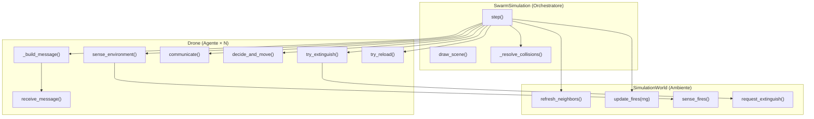
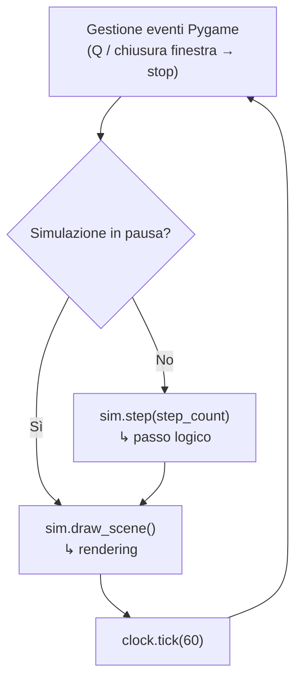
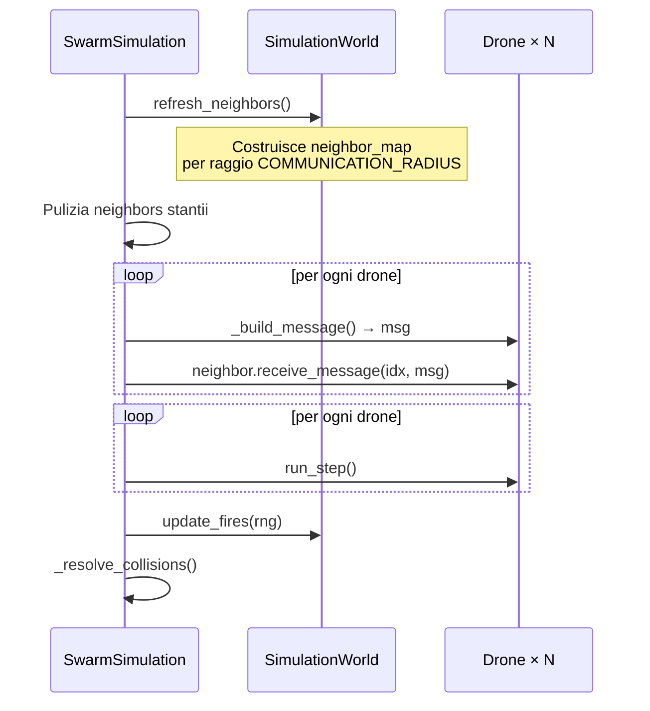
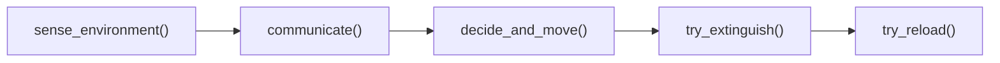
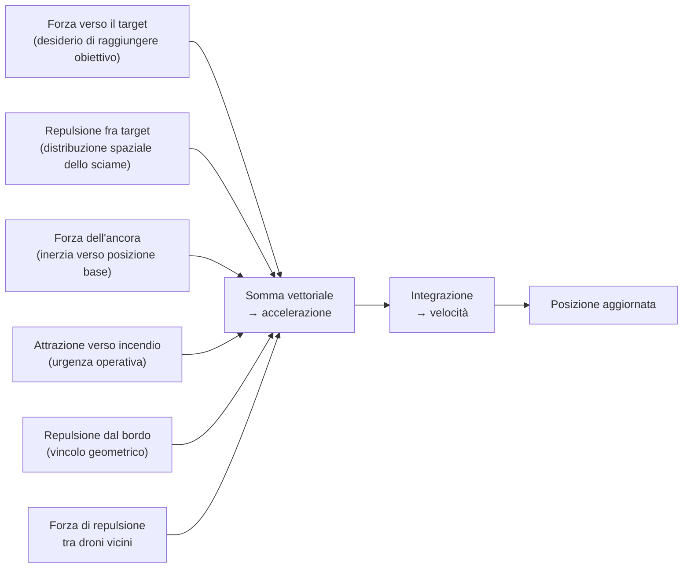
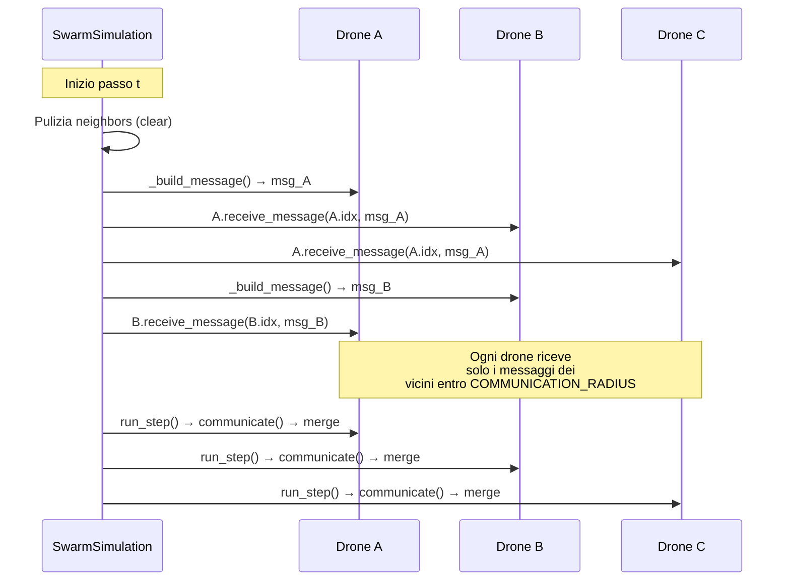
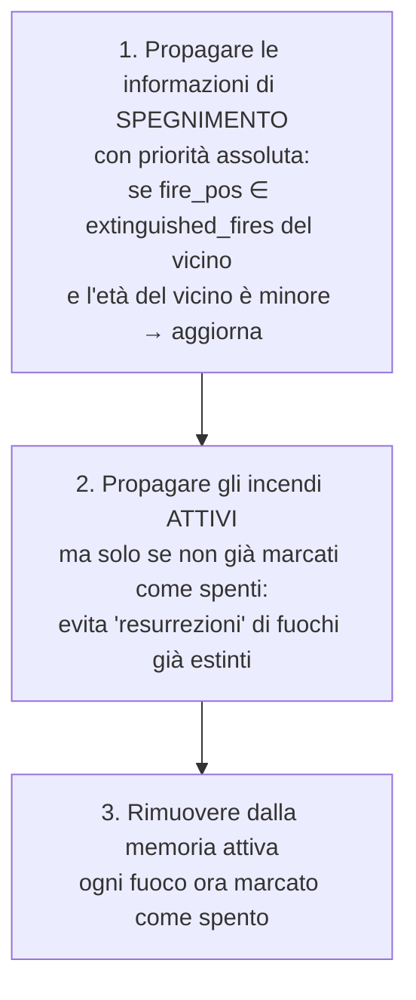
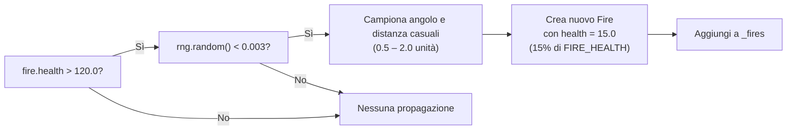
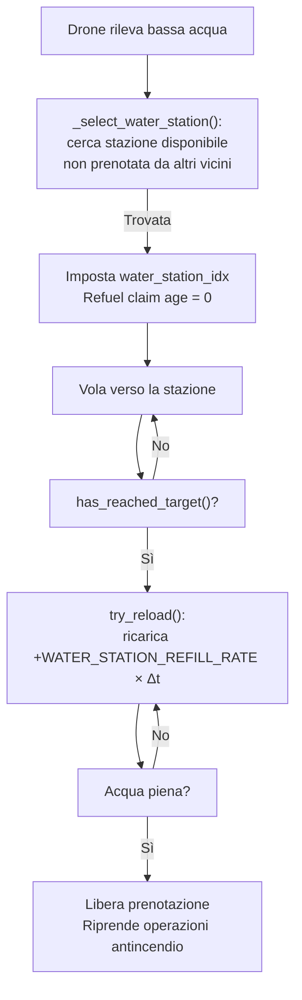
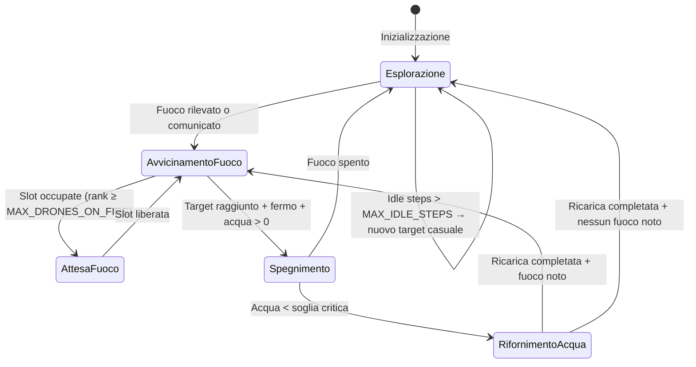

# X-Coverage — Simulazione di Sciame per il Monitoraggio e la Soppressione di Incendi

> *"Un sistema multi-agente decentralizzato per la risposta coordinata a eventi dinamici di incendio in ambienti bidimensionali"*

---

## Indice

1. [Panoramica del sistema](#1-panoramica-del-sistema)
2. [Architettura generale](#2-architettura-generale)
3. [Ciclo di esecuzione principale](#3-ciclo-di-esecuzione-principale)
4. [La pipeline del singolo agente](#4-la-pipeline-del-singolo-agente)
5. [Modello di comunicazione push](#5-modello-di-comunicazione-push)
6. [Propagazione della conoscenza sugli incendi](#6-propagazione-della-conoscenza-sugli-incendi)
7. [Dinamica degli incendi](#7-dinamica-degli-incendi)
8. [Logistica idrica](#8-logistica-idrica)
9. [Controllo del moto](#9-controllo-del-moto)
10. [Collisioni e sicurezza](#10-collisioni-e-sicurezza)
11. [Parametri chiave del sistema](#11-parametri-chiave-del-sistema)
12. [Interfaccia utente e rendering](#12-interfaccia-utente-e-rendering)
13. [Avvio e opzioni da riga di comando](#13-avvio-e-opzioni-da-riga-di-comando)

---

## 1. Panoramica del sistema

X-Coverage è un simulatore di sciame decentralizzato in cui **N droni autonomi** perlustrano un'area bidimensionale, rilevano incendi, ne comunicano la posizione ai vicini e li spengono coordinandosi senza un'autorità centrale. L'ambiente è dinamico: gli incendi crescono nel tempo e, quando raggiungono una massa critica, si propagano spontaneamente generando nuovi focolai nelle vicinanze.

Il sistema è interamente implementato in Python, con rendering in tempo reale via **Pygame** e calcoli vettoriali via **NumPy**.

### Scenario operativo

| Entità | Ruolo |
|---|---|
| **Drone** | Agente autonomo: percepisce, comunica, pianifica e agisce |
| **Fire** | Focolaio d'incendio: cresce, si propaga e può essere spento |
| **WaterStation** | Punto di rifornimento idrico con capacità limitata |
| **SimulationWorld** | Ambiente fisico: sensori simulati, aggiornamento fuochi, query spaziali |
| **SwarmSimulation** | Orchestratore: ciclo di simulazione, rendering, risoluzione collisioni |

---

## 2. Architettura generale



---

## 3. Ciclo di esecuzione principale

Il loop di simulazione è eseguito a **60 frame al secondo** dalla funzione `run_simulation()`. A ogni iterazione:



Il **passo logico** (`step()`) si articola in sei fasi sequenziali:



> [!NOTE]
> La fase di **broadcast** (costruzione e invio dei messaggi) è separata dalla fase di **esecuzione** dei droni. Questo garantisce che tutti i droni ricevano lo snapshot dell'istante *t*, non quello parzialmente aggiornato dell'istante *t+1*.

---

## 4. La pipeline del singolo agente

Ogni drone esegue, nel proprio `run_step()`, la seguente pipeline:



### 4.1 Percezione (`sense_environment`)

Il drone:
1. **Invecchia** le voci nella propria memoria locale (`known_fires`, `extinguished_fires`), eliminando quelle più vecchie di `FIRE_MEMORY_TTL_STEPS` passi.
2. **Verifica** se i fuochi noti si trovano ancora nell'area di rilevamento locale (`FIRE_DETECTION_RADIUS = 2.0`). Se un fuoco rilevato in passato non è più attivo, viene marcato come *spento* nella memoria personale.
3. **Aggiunge** eventuali nuovi fuochi rilevati dai sensori (`sense_fires()`).
4. Invalida il `fire_claim` corrente se il fuoco a cui puntava è scomparso dalla memoria.

### 4.2 Comunicazione (`communicate`)

La comunicazione è stata implementata con un **modello push** (dettagliato nella sezione 5). In questa fase il drone si limita a eseguire il **merge** delle informazioni ricevute nel proprio stato interno.

### 4.3 Decisione e moto (`decide_and_move`)

Il drone applica un campo potenziale composto da più forze vettoriali:



La velocità risultante è limitata a `MAX_DRONE_SPEED = 1.0` unità/s e regolata da un **controller PID** che converte la velocità desiderata in un'accelerazione applicabile.

### 4.4 Selezione del fuoco e priorità

Quando più droni conoscono lo stesso incendio, il sistema assegna le **slot operative** (massimo `MAX_DRONES_ON_FIRE = 3` droni per fuoco) tramite una coda distribuita basata sull'età della conoscenza locale:

- Il drone con la conoscenza **più antica** (età minore = scoperto prima) ha priorità maggiore.
- A parità di età, vince l'indice più basso (tiebreaking deterministico).
- I droni in eccesso vengono indirizzati in **posizioni di attesa** distribuite angolarmente attorno al fuoco.

### 4.5 Spegnimento (`try_extinguish`)

Il drone eroga acqua **solo se**:

1. La velocità corrente è inferiore a `0.05` unità/s (**drone completamente fermo**).
2. Ha raggiunto il target (`has_reached_target()`).
3. Possiede ancora acqua disponibile.
4. Un fuoco attivo si trova entro `FIRE_EXTINGUISH_RADIUS = 1.2` unità.

> [!IMPORTANT]
> Il vincolo di velocità è fondamentale per la sicurezza operativa: un drone in moto non può erogare acqua in modo controllato. Solo una volta che il drone si è stabilizzato sulla propria posizione di lavoro inizia la fase di spegnimento.

---

## 5. Modello di comunicazione push

La comunicazione tra droni è implementata come un **protocollo push attivo**: anziché leggere passivamente lo stato degli altri agenti, ogni drone **trasmette attivamente** il proprio stato ai vicini ad ogni passo.



### Contenuto del messaggio (`DroneMessage`)

Ogni messaggio è uno **snapshot istantaneo** dello stato del mittente:

| Campo | Significato |
|---|---|
| `position` | Posizione corrente nello spazio mondo |
| `velocity` | Vettore velocità |
| `target` | Obiettivo attuale del drone |
| `reloading` | Drone in ricarica idrica? |
| `water_station_idx` | Stazione idrica prenotata |
| `refuel_claim_age` | Età della prenotazione |
| `fire_claim` | Incendio rivendicato |
| `known_fires` | Mappa posizione → età di tutti gli incendi noti |
| `extinguished_fires` | Mappa posizione → età degli incendi spenti (con TTL) |

> [!NOTE]
> La separazione temporale tra broadcast e run_step assicura **coerenza causale**: tutti i droni operano sullo snapshot *t*, evitando che un drone che si aggiorna prima "inquini" la vista degli altri con informazioni di *t+1*.

---

## 6. Propagazione della conoscenza sugli incendi

La conoscenza degli incendi si propaga per **gossip transitivo** attraverso lo sciame: un drone che non ha rilevato direttamente un fuoco può conoscerlo perché un vicino glielo ha comunicato, e questo vicino lo aveva a sua volta appreso da un altro drone.

### Merge della conoscenza (`merge_fire_knowledge`)

Il merge segue tre regole di priorità:



Questo schema garantisce che l'informazione di **spegnimento** si propaghi nello sciame più velocemente di qualsiasi voce obsoleta di "fuoco attivo", prevenendo oscillazioni nella pianificazione.

---

## 7. Dinamica degli incendi

### 7.1 Crescita

Ogni fuoco attivo incrementa la propria `health` di `FIRE_GROWTH_RATE × Δt` ad ogni passo. La vita è illimitata verso l'alto: un fuoco mai spento continua a crescere indefinitamente.

### 7.2 Propagazione (fire spawning)

Quando un fuoco supera il **120% della vita iniziale** (`FIRE_HEALTH × 1.20 = 120.0`), ad ogni passo ha una probabilità di `FIRE_SPAWN_PROB_PER_STEP = 0.003` di generare un nuovo focolaio figlio:



Il fuoco figlio nasce con vita bassa (`15.0` punti) e viene immediatamente aggiunto alla lista degli incendi attivi, dove inizierà a crescere autonomamente. Non è rilevato istantaneamente dai droni: devono entrarvi nel raggio di rilevamento.

### 7.3 Spegnimento

L'acqua è erogata dal drone alla portata di `DRONE_WATER_FLOW_RATE = 5.0` unità/s, sottratta dalla `health` del fuoco. Quando `health ≤ 0`, il fuoco viene rimosso dalla lista degli attivi.

---

## 8. Logistica idrica

La risorsa idrica è il principale **collo di bottiglia operativo** del sistema. Ogni drone dispone di una capacità di `20.0` unità. Quando scende sotto `LOW_WATER_THRESHOLD = 2.0` unità, il drone abbandona il fuoco e si dirige verso una stazione idrica.

### Gestione delle stazioni (accesso esclusivo distribuito)



Ogni stazione ha una capacità di `WATER_STATION_CAPACITY = 2` droni simultanei. Il sistema di prenotazione è distribuito: ogni drone legge le prenotazioni dei vicini nei `DroneMessage` e seleziona solo stazioni non saturate, senza un coordinatore centrale.

---

## 9. Controllo del moto

### 9.1 Dinamica del target

Ogni drone possiede un **target mobile** (punto obiettivo nello spazio mondo) che evolve in base alle forze applicate. Il target non è la posizione fisica del drone: è la destinazione desiderata verso cui il drone converge. Il target stesso è soggetto a forze di repulsione (tra i target dei droni vicini) e di vincolo (bordi dell'area).

### 9.2 Controller PID sulla velocità

Il mapping dalla distanza al target alla velocità desiderata avviene tramite:

$$v_{desired} = \frac{\Delta p}{\tau}$$

dove $\Delta p$ è la distanza al target e $\tau = 0.3$ s è la costante di tempo. La velocità desiderata viene poi trasformata in accelerazione da un **controller PID**:

$$a = K_p \cdot e_v + K_i \cdot \int e_v \, dt + K_d \cdot \dot{e}_v$$

con $K_p = 3.4$, $K_i = 0.6$, $K_d = 0.25$. L'output è saturato a `PID_MAX_OUTPUT_ACCEL = 4.0` m/s².

### 9.3 Jerk limiting

Il sistema limita anche la variazione dell'accelerazione nel tempo (`MAX_JERK = 8.0` m/s³), producendo traiettorie più fluide e realistiche.

---

## 10. Collisioni e sicurezza

### Collision avoidance attivo

Ogni coppia di droni vicini genera una **forza repulsiva** che cresce con l'avvicinarsi dell'ellisse di sicurezza (`SAFE_DISTANCE_BASE = 2.4` unità). L'ellisse è allungata lungo la direzione della velocità relativa, simulando un volume di sicurezza dinamico.

### Rilevamento statistico delle collisioni fisiche

`_resolve_collisions()` scansiona ogni coppia di droni e conta quanti si trovano entro `DRONE_IMPACT_RADIUS = 0.1` unità (collisione fisica effettiva). Questo dato è usato per il monitoraggio e il logging, ma non altera la posizione dei droni (la separazione è gestita in anticipo dalle forze di campo).

---

## 11. Parametri chiave del sistema

| Categoria | Parametro | Valore | Significato |
|---|---|---|---|
| **Ambiente** | `AREA_WIDTH × AREA_HEIGHT` | 20 × 12 | Dimensioni dell'area in unità mondo |
| **Sciame** | `NUM_DRONES` | 12 | Numero di droni |
| **Comunicazione** | `COMMUNICATION_RADIUS` | 2.5 | Raggio di vicinanza per il broadcast |
| **Fuoco** | `FIRE_HEALTH` | 100.0 | Vita iniziale di ogni fuoco |
| **Fuoco** | `FIRE_GROWTH_RATE` | 0.5 hp/s | Crescita per unità di tempo |
| **Fuoco** | `FIRE_SPAWN_THRESHOLD` | 1.20 × | Soglia di propagazione |
| **Fuoco** | `FIRE_SPAWN_PROB_PER_STEP` | 0.003 | Probabilità di spawn per passo |
| **Spegnimento** | `FIRE_EXTINGUISH_RADIUS` | 1.2 | Raggio di azione dell'acqua |
| **Spegnimento** | `DRONE_WATER_FLOW_RATE` | 5.0 u/s | Portata idrica del drone |
| **Spegnimento** | `_EXTINGUISH_SPEED_THRESHOLD` | 0.05 u/s | Velocità massima per spegnere |
| **Acqua** | `DRONE_WATER_CAPACITY` | 20.0 | Capacità massima del serbatoio |
| **Stazioni** | `NUM_WATER_STATIONS` | 3 | Stazioni idriche disponibili |
| **Stazioni** | `WATER_STATION_CAPACITY` | 2 | Droni simultanei per stazione |
| **Memoria** | `FIRE_MEMORY_TTL_STEPS` | 100 | Passi prima di dimenticare un fuoco |
| **Controllo** | `MAX_DRONE_SPEED` | 1.0 u/s | Velocità massima fisica |
| **Controllo** | `TAU` | 0.3 s | Costante di tempo PID |

---

## 12. Interfaccia utente e rendering

Il renderer (`draw_scene()`) sovrappone diversi strati visuali in sequenza:

| Strato | Contenuto |
|---|---|
| **Sfondo** | Gradiente verde scuro |
| **Stazioni idriche** | Cerchi blu con indicatore di capacità |
| **Fuochi** | Cerchi rosso/arancio con dimensione proporzionale alla `health` |
| **Linee tratteggiate** *(alpha blend)* | Target (viola semitrasparente) e ancora (verde semitrasparente) |
| **Droni** | Corpo con colore acqua (blu → rosso al diminuire dell'acqua), indicatori di stato |
| **Vettori forza** *(opzionale)* | Visualizzazione delle forze interne per debug |
| **HUD** | Step count, collisioni totali, droni in spegnimento/ricarica |

Le linee tratteggiate sono disegnate su una **surface SRCALPHA** separata e poi blittata sullo schermo, garantendo un autentico alpha blending anche su superfici opache.

### Comandi interattivi

| Tasto | Azione |
|---|---|
| **Q** / chiusura finestra | Termina la simulazione |
| **P** o **Spazio** | Mette in pausa / riprende |
| **V** | Alterna la visualizzazione dei vettori forza |

---

## 13. Avvio e opzioni da riga di comando

```bash
python pymain.py [opzioni]
```

| Opzione | Descrizione |
|---|---|
| `--random-fires` | Genera incendi in posizioni casuali (default: posizioni fisse) |
| `--random-stations` | Genera stazioni idriche in posizioni casuali |
| `--log-collisions` | Abilita il logging dettagliato delle collisioni fisiche |

La simulazione termina **esclusivamente** tramite interazione dell'utente (tasto Q, chiusura finestra) o kill del processo da terminale. Non esiste alcun meccanismo di arresto automatico.

---

## Diagramma di stato del singolo drone



---

*Documento generato automaticamente — Revisione: settembre 2026*

