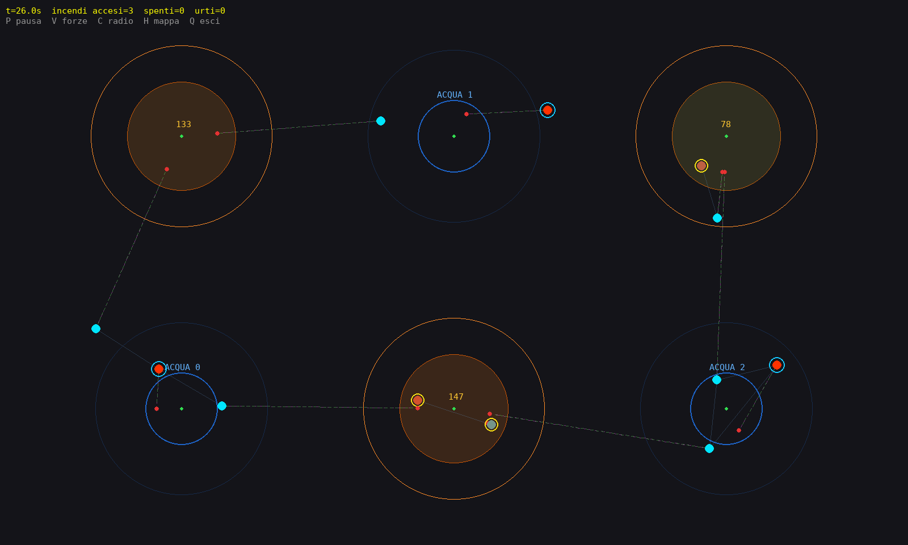

# X-Coverage

Uno sciame di droni autonomi sorveglia un'area, trova gli incendi, li spegne e va a rifornirsi
d'acqua. Nessuno li comanda: non esiste una centrale che assegni gli incendi o i turni alla stazione
idrica. Ogni drone decide da solo con quello che vede, quello che ricorda e quello che si sente dire
dai vicini via radio.



```bash
pip install -r requirements.txt
python main.py                      # guarda lo sciame lavorare
python main.py experiment ablation  # misura quanto serve ciascun meccanismo
python main.py test                 # verifica che tutto funzioni
```

## Il problema

Dodici droni, un'area di 20 × 12 metri, tre incendi che crescono se nessuno li spegne e si propagano
se crescono troppo. Ogni drone vede solo entro 2 metri e parla solo entro 2.5. Porta 20 unità
d'acqua, che bastano per 4 secondi di getto, mentre un incendio ne richiede 200: servono dieci
viaggi, e le stazioni hanno due posti ciascuna.

Da lì nasce la domanda interessante: come si accorda uno sciame su chi va dove, se nessuno ha una
visione d'insieme e le informazioni arrivano vecchie e incomplete?

## Come si lancia

```bash
python main.py                              # la finestra, scenario standard
python main.py --seed 7 --random-fires      # un'altra situazione di partenza
python main.py --headless --time 120        # nessuna finestra: solo il risultato finale
```

Le altre opzioni: `--random-stations`, `--log` (stampa ogni urto). Nella finestra: `P` pausa,
`V` forze, `C` collegamenti radio, `H` mappa del terreno, `Q` esci.

**Misurare.** `experiment` confronta varianti del sistema nella stessa identica situazione. Senza
nome elenca le domande pronte (`ablation`, `urti`, `guasti`, `radio`, `difficolta`, `flotta`,
`copertura`, `importanza`); con un nome la esegue:

```bash
python main.py experiment guasti --runs 20
```

Partono 4 varianti × 20 simulazioni in parallelo sui core disponibili. Le 20 di ogni variante usano
**gli stessi seed**, quindi due varianti affrontano gli stessi incendi con i droni negli stessi
punti di partenza: il confronto avviene **a coppie** e la fortuna dello scenario si elide. In
`results/guasti_<data>/` finiscono `report.md`, con media, intervallo di confidenza al 95% e i
simboli ▲▼◆ sulle differenze che il test non riesce a spiegare come fortuna, e `runs.csv` con una
riga per simulazione.

Due cose da sapere leggendo un report: **significativo non vuol dire grande**, e i test sono tanti
(una quarantina di misure per variante), quindi le probabilità sono corrette con il metodo di Holm —
senza, una decina di marcatori per report sarebbero falsi allarmi.

Aggiungere una domanda propria costa quattro righe in `EXPERIMENTS`, dentro
[`experiments.py`](experiments.py); qualsiasi parametro di `SimConfig` può diventare una variante:

```python
"memoria": Experiment(
    "Quanto a lungo conviene ricordare un incendio di cui si è solo sentito parlare?",
    SCENARIOS["critico"],
    [Variant(f"memoria {seconds} s", {"FIRE_MEMORY_TTL_S": seconds}) for seconds in (5, 15, 45)]),
```

**Verificare.** `python main.py test` esegue una quarantina di controlli in un minuto: le traiettorie
non sono cambiate, ogni interruttore fa quello che dice, un drone non conosce gli altri droni, la
statistica torna su casi noti.

## Come leggere il codice

Cinque file, in quest'ordine. Ognuno si apre con un commento che dice cosa c'è dentro e perché.

| File | Cosa contiene |
|---|---|
| [`world.py`](world.py) | I parametri e il mondo fisico: incendi, terreno, radio, sensori. |
| [`drone.py`](drone.py) | L'agente: cosa sa, come decide, come vola. |
| [`simulation.py`](simulation.py) | Il giro di ogni passo, le conseguenze degli urti e la finestra. |
| [`experiments.py`](experiments.py) | Le misure, gli esperimenti e i report con la statistica. |
| [`tests.py`](tests.py) | Le verifiche automatiche. |

Un solo file eseguibile, [`main.py`](main.py), li mette insieme.

## Cosa fa un drone, un passo alla volta

Ogni centesimo di secondo simulato (`Drone._think()`, in fondo a [`drone.py`](drone.py)):

```
   legge i messaggi arrivati
        ↓
   guarda intorno a sé (2 m) e invecchia i ricordi
        ↓
   unisce quello che dicono i vicini a quello che sa
        ↓
   decide  →  acqua quasi finita?  vado alla stazione
        ↓      conosco un incendio libero?  ci vado
        ↓      nessuno dei due?  perlustro
   vola: obiettivo + evitamento → PID → accelerazione → posizione
```

E lo sciame, sempre nello stesso ordine (`Simulation._advance_one_step()`):

```
chi sente chi  →  un battito del clock  →  gli incendi crescono  →  si controllano gli urti
                   ├─ fase 1: TUTTI trasmettono
                   ├─ fase 2: TUTTI ragionano e si muovono
                   └─ fase 3: TUTTI agiscono (spruzzano acqua, caricano)
```

Le tre fasi separate rendono la simulazione equa: chi ragiona per primo non sa cosa hanno appena
fatto gli altri, e nessuno decide guardando un incendio che un altro ha appena spento nello stesso
battito. E nessuno "esegue" i droni: ognuno si iscrive al `Clock` lasciandogli le proprie funzioni
private, e da lì in poi l'unica cosa che lo fa agire è il tempo che passa.

## Le quattro idee che tengono in piedi il sistema

**1. Le notizie invecchiano.** Un drone non ricorda "qui c'è un incendio", ma "qui c'è un incendio, e
questa notizia ha 37 centesimi di secondo". Quando due droni si incontrano tengono la versione più
fresca: un avvistamento si propaga di vicino in vicino fino a chi è a venti metri, e ciò che nessuno
conferma scade da sé. Chi passa sul posto e non vede nulla genera la smentita, che ha la precedenza.

**2. Le regole di precedenza sostituiscono l'accordo.** Nessuno assegna gli incendi: chi deve
decidere ordina i pretendenti con una regola — prima chi ci sta già lavorando, poi chi è più vicino,
a parità l'indice più basso — e se ne trova già tre davanti si tira indietro. Tutti applicano la
stessa regola agli stessi dati e arrivano alla stessa conclusione, senza un messaggio in più.
Funziona perché due droni sullo stesso incendio stanno per forza dentro il raggio radio: vincoli di
questo tipo sono controllati all'avvio da `validate_config()` invece di restare impliciti.

**3. La geometria fa il lavoro del coordinatore.** Chi arriva su un incendio non punta al centro ma a
un anello di 80 cm, dal lato da cui arriva: l'obiettivo fissa la distanza, e *dove* disporsi lungo
l'anello lo decide l'evitamento collisioni, che spinge i droni di lato finché non sono distanziati.
Tre droni si dispongono attorno al fuoco senza che nessuno lo decida. Idem per la coda all'acqua.

**4. Scansarsi guardando avanti.** Per ogni vicino il drone calcola *quando* e *con quanto scarto* si
mancheranno se entrambi proseguono dritti, e spinge nella direzione di quello scarto: si sposta di
lato invece di frenare. La matematica sta nel commento di `_avoidance_correction()`.

## Urti e guasti

Due droni che si toccano si rompono e non tornano più a volare. Sotto 0.6 m/s di velocità relativa
si rompono solo i motori, sopra si spegne anche la radio; un relitto caduto dentro un incendio brucia
e dopo venti secondi tace pure lui. Nella finestra sono delle X.

Un relitto **non è un ostacolo**: sta a terra e chi vola gli passa sopra. Ogni drone dichiara nel
proprio messaggio se sta ancora volando — cosa che un multirotore vero sa di sé senza sforzo
(assetto ribaltato, accelerometro fermo a 1 g, giri dei motori a zero). Senza quella dichiarazione
uno sciame gira al largo dei rottami e un drone caduto su un posto di rifornimento lo rende
inutilizzabile per sempre. Chi preferisce il rottame ingombrante ha `WRECK_BLOCKS_FLIGHT`, che è
anche una variante dell'esperimento `urti`.

**Quanto vale l'evitamento** (esperimento `urti`): con l'evitamento attivo i droni non si toccano
mai, e rendere gli urti letali non cambia nulla. Senza, sei urti mettono a terra undici droni su
dodici e la riuscita crolla dal 92% all'8%.

**Il guasto peggiore non è quello più grave.** Un drone può rompersi in tre modi, ordinati non per
danno alla macchina ma per quanto l'avaria è *onesta*: perdita totale (radio spenta, per lo sciame
non esiste più), avaria dichiarata ("sono a terra"), oppure **guasto silenzioso** — la radio si
blocca sull'ultima fotografia e continua a dire *"sto volando, mi sto occupando di quell'incendio"*.
Gli altri gli lasciano l'incendio, aspettano il suo turno alla stazione e si ripetono le sue notizie,
che non invecchiando più sembrano sempre appena confermate.

L'esperimento `guasti` rompe tre droni su dodici al secondo 30 di uno sciame sano, cambiando **solo
il modo** in cui si rompono (20 simulazioni per variante):

| | nessun guasto | perdita totale | avaria dichiarata | guasto silenzioso |
|---|---|---|---|---|
| Missione riuscita | 70% | 70% | 70% | **50%** |
| Tempo per spegnere tutto | 140 s | 169 s | 158 s | **184 s** |
| Incendi fantasma per drone | 0.08 | 0.10 | 0.10 | **0.31** |

Perdere tre droni **in modo onesto non cambia la probabilità di riuscita**: lo sciame se ne accorge,
si riorganizza e paga una ventina di secondi. Perderli in silenzio la porta al 50%. Il meccanismo si
vede nei fantasmi, che triplicano: non è lo sciame che perde braccia, è la memoria collettiva che si
avvelena. (È anche l'unica delle tre differenze che il test marca come reale: sulla percentuale di
riuscita venti simulazioni non bastano.)

## Cercare, non solo spegnere

Quando non c'è niente da spegnere, un drone deve decidere **dove andare a guardare**. Nello scenario
«ricerca» (area quattro volte più grande, incendi che si accendono da soli) ci passa l'80% del tempo.
`EXPLORATION_MODE` sceglie come: `"random"` estrae un punto a caso, `"coverage"` usa la memoria di
dove si è già guardato.

**Da dove viene.** È la famiglia del *coverage control* (l'algoritmo di Lloyd portato ai robot mobili
da Cortés, Martínez, Karataş e Bullo, *Coverage control for mobile sensing networks*, 2004): si
divide lo spazio dando a ciascuno i punti più vicini a lui che a chiunque altro — la **partizione di
Voronoi** — e dentro la propria zona ci si sposta verso il punto migliore secondo una densità φ(x).
Qui φ è una mappa di importanza fatta di gaussiane, e la copertura **decade nel tempo**: è il
passaggio al *persistent coverage*, dove non basta disporsi bene una volta perché l'informazione
invecchia.

Voronoi non è una scelta estetica: è l'unica divisione coerente con "ci va quello più vicino", ed è
**calcolabile da soli**, dalle sole posizioni degli altri, senza che nessuno assegni le aree. La
differenza rispetto alla teoria è che qui la zona si calcola **solo con i droni che si sentono via
radio**: due droni che non si sentono si considerano entrambi padroni della stessa area e possono
controllare lo stesso posto. È il prezzo di non avere una visione globale, non un bug.

Dentro la propria zona si sceglie la cella che costa meno:

```
costo(cella) = − importanza^γ · obsolescenza[s]  +  COVERAGE_W_DIST · distanza[m]
```

cioè conviene andare dove il terreno conta **e** non si guarda da tempo, e non conviene fare troppa
strada. L'obsolescenza è in secondi e cresce senza limite: se fosse un valore tra 0 e 1, come la
freschezza, dopo pochi secondi nessuna cella varrebbe più di un paio di metri di volo e i droni si
fermerebbero dove sono. Ogni drone tiene una griglia da 50 cm in cui segna
**l'istante** dell'ultima occhiata; unire due mappe è un massimo cella per cella, quindi ordine,
doppioni e messaggi persi non contano, e la mappa può viaggiare di rado pur essendo il dato più
pesante del messaggio. Il tasto `H` la mostra: in blu ciò che nessuno guarda da un minuto.

**Il risultato** (`experiment copertura --runs 30`, scenario «ricerca»):

| | ricerca casuale | **copertura uniforme** | copertura pesata (γ = 1) |
|---|---|---|---|
| Fuoco acceso in media | 164 | **91** | 231 |
| ...ma la **mediana** | 79 | 85 | 100 |
| Le tre simulazioni peggiori | 870, 922, 977 | **135, 153, 214** | 865, 949, 1038 |
| Missioni fuori controllo | 3 su 30 | **0 su 30** | 4 su 30 |
| Incendi mai avvistati | 3.6 | **1.4** | 6.8 |

**Nel caso normale la perlustrazione sistematica non serve**: vince in appena 13 casi su 30 e la
mediana è identica. **Serve a non perdere le partite che si perdono male**: le tre simulazioni
peggiori passano da ~900 a ~170, e le tre missioni finite fuori controllo diventano zero. Ogni tanto
la ricerca casuale lascia un angolo senza controllo abbastanza a lungo perché un incendio ci cresca
indisturbato. Ricordarsi dove si è guardato non migliora la media: **elimina la coda** — ed è il tipo
di conclusione che una media da sola nasconde (infatti sulle medie il test dà p ≈ 0.2).

**Concentrarsi sulle zone di valore peggiora le cose**: la variante pesata presidia benissimo gli
hotspot ma abbandona il resto, dove gli incendi si accendono lo stesso, e ne lascia 6.8 per partita
senza mai vederli. `experiment importanza` mostra che ogni aumento di γ peggiora danno, incendi mai
visti e obsolescenza complessiva.

## Onestà sui limiti

- **L'ambiente è centralizzato, il controllo no.** Il simulatore conosce tutto perché *è* la realtà
  fisica, ma non decide mai al posto dei droni: non c'è una riga che assegni un incendio a qualcuno.
- **Nessuna risposta fisica all'urto**: i droni non rimbalzano, si rompono e cadono.
- **Il limite di tre droni per incendio vale sull'incendio, non lungo il tragitto**: chi converge da
  lontano non si sente finché non si avvicina.
- **Il modello di incendio è un'astrazione**: un punto con una "vita" che cresce, non un fronte di
  fiamma con vento e combustibile. I droni volano su un piano, senza assetto né quota.

## Requisiti

Python 3.9 o successivo, `numpy` e `pygame` (quest'ultimo solo per la finestra: esperimenti e test
girano senza).
